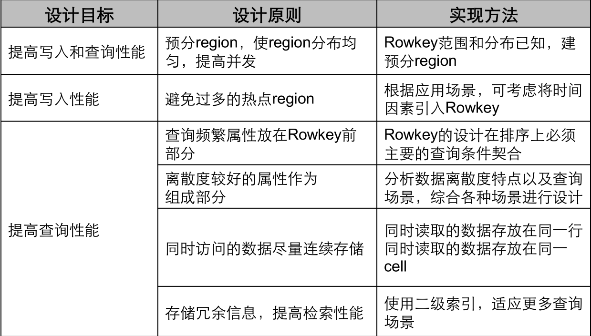

# 一、hbase架构 #
  物理上看, HBase系统有3种类型的后台服务程序, 分别是Region server, Master server 和 zookeeper.

> Region server负责实际数据的读写. 当访问数据时, 客户端与HBase的Region server直接通信.

> Master server管理Region的位置, DDL(新增和删除表结构)

> Zookeeper负责维护和记录整个HBase集群的状态.

所有的HBase数据都存储在HDFS中. 每个 Region server都把自己的数据存储在HDFS中. 如果一个服务器既是Region server又是HDFS的Datanode. 那么这个Region server的数据会在把其中一个副本存储在本地的HDFS中, 加速访问速度.

但是, 如果是一个新迁移来的Region server, 这个region server的数据并没有本地副本. 直到HBase运行compaction, 才会把一个副本迁移到本地的Datanode上面.

## HBase Region server ##

HBase的表根据Row Key的区域分成多个Region, 一个Region包含这这个区域内所有数据. 而Region server负责管理多个Region, 负责在这个Region server上的所有region的读写操作. 一个Region server最多可以管理1000个region.

## HBase Master server ##
HBase Maste主要负责分配region和操作DDL(如新建和删除表)等,

HBase Master的功能:
* 协调Region server
* 在集群处于数据恢复或者动态调整负载时,分配Region到某一个Region Server中
* 管控集群, 监控所有RegionServer的状态
* 提供DDL相关的API, 新建(create),删除(delete)和更新(update)表结构.

## ZooKeeper: 集群"物业"管理员 ##
Zookeepper是一个分布式的无中心的元数据存储服务. zookeeper探测和记录HBase集群中服务器的状态信息. 如果zookeeper发现服务器宕机, 它会通知Hbase的master节点. 在生产环境部署zookeeper至少需要3台服务器, 用来满足zookeeper的核心算法Paxos的最低要求.

如图, zookeeper有三台服务器, region server和master节点都通过heartbeat的方式向zookeeper报告状态
## ZooKeeper, Master和 Region server协同工作 ##
Zookeepr负责维护集群的memberlist, 哪台服务器在线,哪台服务器宕机都由zookeeper探测和管理. Region server, 主备Master节点主动连接Zookeeper, 维护一个Session连接,这个session要求定时发送heartbeat, 向zookeeper说明自己在线, 并没有宕机.

ZooKeeper有一个Ephemeral Node(临时节点)的概念, session连接在zookeeper中建立一个临时节点(Ephemeral Node), 如果这个session断开, 临时节点被自动删除.

所有Region server都尝试连接Zookeeper, 并在这个session中建立一个临时节点(Ephemeral node). HBase的master节点监控这些临时节点的是否存在, 可以发现新加入region server和判断已经存在的region server宕机.

为了高可用需求, HBase的master也有多个, 这些master节点也同时向Zookeeper注册临时节点(Ephemeral Node). Zookeeper把第一个成功注册的master节点设置成active状态, 而其他master node处于inactive状态.

如果zookeeper规定时间内, 没有收到active的master节点的heartbeat, 连接session超时, 对应的临时节也自动删除. 之前处于Inactive的master节点得到通知, 马上变成active状态, 立即提供服务.

同样, 如果zookeeper没有及时收到region server的heartbeat, session过期, 临时节点删除. HBase master得知region server宕机, 启动数据恢复方案.

# 二、HBase的第一次读写流程 #
HBase把各个region的位置信息存储在一个特殊的表中, 这个表叫做Meta table.

Zookeeper里面存储了这个Meta table的位置信息.

HBase的访问流程:

1. 客户端访问Zookeep, 得到了具体Meta table的位置

2. 客户端再访问真正的Meta table, 从Meta table里面得到row key所在的region server

3. 访问rowkey所在的region server, 得到需要的真正数据.

客户端缓存meta table的位置和row key的位置信息, 这样就不用每次访问都读zookeeper.

如果region server由于宕机等原因迁移到其他服务器. Hbase客户端访问失败, 客户端缓存过期, 再重新访问zookeeper, 得到最新的meta table位置, 更新缓存.

## HBase Meta Table ##
Meta table存储所有region的列表

Meta table用类似于Btree的方式存储

Meta table的结构如下:

- Key: region的开始row key, region id
- Values: Region server

## Region Server的结构 ##
Region Server运行在HDFS的data node上面, 它有下面4个部分组成:

* WAL: 预写日志(Write Ahead Log)是一HDFS上的一个文件, 如果region server崩溃后, 日志文件用来恢复新写入的的, 但是还没有存储在硬盘上的数据.
* BlockCache: 读取缓存, 在内存里缓存频繁读取的数据, 如果BlockCache满了, 会根据LRU算法(Least Recently Used)选出最不活跃的数据, 然后释放掉
* MemStore: 写入缓存, 在数据真正被写入硬盘前, Memstore在内存中缓存新写入的数据. 每个region的每个列簇(column family)都有一个memstore. memstore的数据在写入硬盘前, 会先根据key排序, 然后写入硬盘.
* HFiles: HDFS上的数据文件, 里面存储KeyValue对.

# 三、HBase的写入流程 #
## 1.将数据写入memstore中 ##

**1.1、当hbase客户端发起Put请求, 第一步是将数据写入预写日志(WAL)**

* 将修改的操作记录在预写日志(WAL)的末尾
* 预写日志(WAL)被用来在region server崩溃时, 恢复memstore中的数据

​                                              WAL总写入到文件末尾, 是顺序写入, 写入速度较快

**1.2、数据写入预写日志(WAL), 并存储在memstore之后, 向用户返回写成功.**

  
### HBase MemStore ###

MemStore在内存按照Key的顺序, 存储Key-Value对, 一个Memstore对应一个列簇(column family). 同样在HFile里面, 所有的Key-Value对也是根据Key有序存储.

## 2.HBase Region Flush ##

当Memstore累计了足够多的数据, Region server将Memstore中的数据写入HDFS, 存储为一个HFile. 每个列簇(column family)对于多个HFile, 每个HFile里面就是实际存储的数据.

这些HFile都是当Memstore满了以后, Flush到HDFS中的文件. 注意到HBase限制了列簇(column family)的个数. 因为每个列簇(column family)都对应一个Memstore. [*译注: 太多的memstore占用过多的内存*].

当Memstore的数据Flush到硬盘时, 系统额外保存了最后写入操作的序列号(last written squence number), 所以HBase知道有多少数据已经成功写入硬盘. 每个HFile都记录这个序号, 表明这个HFile记录了多少数据和从哪里继续写入数据.

在region server启动后, 读取所有HFile中最高的序列号, 新的写入序列号从这个最高序列号继续向上累加.

### HBase HFile ###

HFile中存储有序的Key-Value对. 当Memstore满了之后, Memstore中的所有数据写入HDFS中,形成一个新的HFile. 这种大文件写入是顺序写, 因为避免了机械硬盘的磁头移动, 所以写入速度非常快.

#### HBase HFile Structure ####
HFile存储了一个多级索引(multi-layered index), 查询请求不需要遍历整个HFile查询数据, 通过多级索引就可以快速得到数据(工作机制类似于b+tree)

* Key-Value按照升序排列
* Key-Value存储在以64KB为单位的Block里
* 每个Block有一个叶索引(leaf-index), 记录Block的位置
* 每个Block的最后一个Key(译注: 最后一个key也是最大的key), 放入中间索引(intermediate index)
* 根索引(root index)指向中间索引

尾部指针(trailer pointer)在HFile的最末尾, 它指向元数据块区(meta block), 布隆过滤器区域和时间范围区域. 查询布隆过滤器可以很快得确定row key是否在HFile内, 时间范围区域也可以帮助查询跳过不在时间区域的读请求.

#### HFile索引 ####

当打开HFile后, 系统自动缓存HFile的索引在Block Cache里, 这样后续查找操作只需要一次硬盘的寻道.

## 3.HBase Minor Compaction ##

HBase自动选择较小的HFile, 将它们合并成更大的HFile. 这个过程叫做minor compaction. Minor compaction通过合并小HFile, 减少HFile的数量.

HFile的合并采用归并排序的算法.

*译注: 较少的HFile可以提高HBase的读性能*

## 4.HBase Major Compaction ##

Major compaction指一个region下的所有HFile做归并排序, 最后形成一个大的HFile. 这可以提高读性能. 但是, major compaction重写所有的Hfile, 占用大量硬盘IO和网络带宽. 这也被称为写放大现象(write amplification)

Major compaction可以被调度成自动运行的模式, 但是由于写放大的问题(write amplification), major compaction通常在一周执行一次或者只在凌晨运行. 此外, major compaction的过程中, 如果发现region server负责的数据不在本地的HDFS datanode上, major compaction除了合并文件外, 还会把其中一份数据转存到本地的data node上.

## 5.Region的拆分 ##

最初, 每张表只有一个region, 当一个region变得太大时, 它就分裂成2个子region. 2个子region, 各占原始region的一半数据, 仍然被相同的region server管理. Region server向HBase master节点汇报拆分完成.

如果集群内还有其他region server, master节点倾向于做负载均衡, 所以master节点有可能调度新的region到其他region server, 由其他region管理新的分裂出的region.

# 四、HBase的混合读(Read Merge) #

我们发现HBase中的一个row里面的数据, 分配在多个地方. 已经持久化存储的Cell在HFile, 最近写入的Cell在Memstore里, 最近读取的Cell在Block cache里. 所以当你读HBase的一行时, 混合了Block cache, memstore和Hfiles的读操作

1. 首先, 在Block cache(读cache)里面查找cell, 因为最近的读取操作都会缓存在这里. 如果找到就返回, 没有找到就执行下一步
2. 其次, 在memstore(写cache)里查找cell, memstore里面存储里最近的新写入, 如果找到就返回, 没有找到就执行下一步
3. 最后, 在读写cache中都查找失败的情况下, HBase查询Block cache里面的Hfile索引和布隆过滤器, 查询有可能存在这个cell的HFile, 最后在HFile中找到数据.

# 五、Hbase表设计 #
## 1、总体原则 ##

## 2、表设计 ##
* 建表周期
	* 周期建表
	* 分表
	
* 预分region
	* 识别可能的热点Key区域

* Family属性
	* TTL/Versions/Compression/Bloomfilter/Cache

* 系统并发能力、数据清理能力
	* 利用集群的分布能力（并发能力），提高集群业务吞吐量
	* 利用过期时间、版本个数设置等操作，让表能自动清除过期数据

## 3、RowKey设计 ##

* 原则
	* 需要同时访问的数据，Rowkey尽量连续
* 访问效率
	* 分散写：调高并发度，但又不能过于分散
	* 连续读：使用scan接口
* 属性值顺序
	* 离散度好的属性放在前面
	* 访问权值高的属性值放在前面
* 时间属性
	* 循环key + TTL
	* 周期建表

 **多业务场景工业Rowkey会导致数据访问矛盾，解决方法：**
* 折中法
* 冗余法
* 二级索引

## 4、Family设计 ##

* 可枚举数量少扩展性弱的属性作为Family
* 考虑因素
	* 分表vs 分Family
	* 同时读取的数据存放在同一个Family
	* 均衡各Family 的数据量
* 不同的Family 设置不同的属性

## 5、Qualifier设计 ##
* 不可枚举、数量多且扩展属性强的属性作为qualifier
* 原则
	* 同时访问的数据存放到同一个Cell
	* 列名尽量简短

