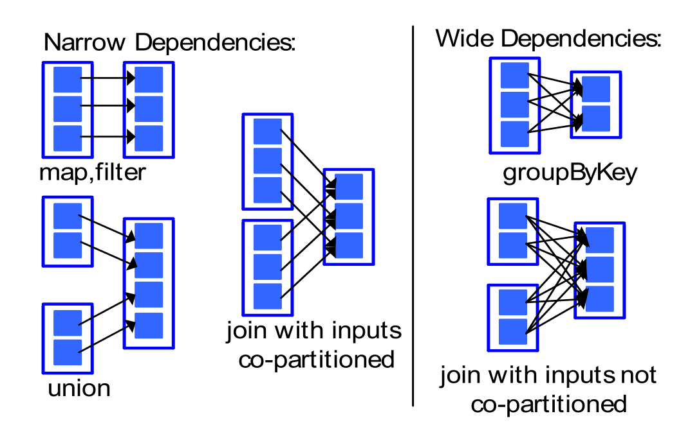
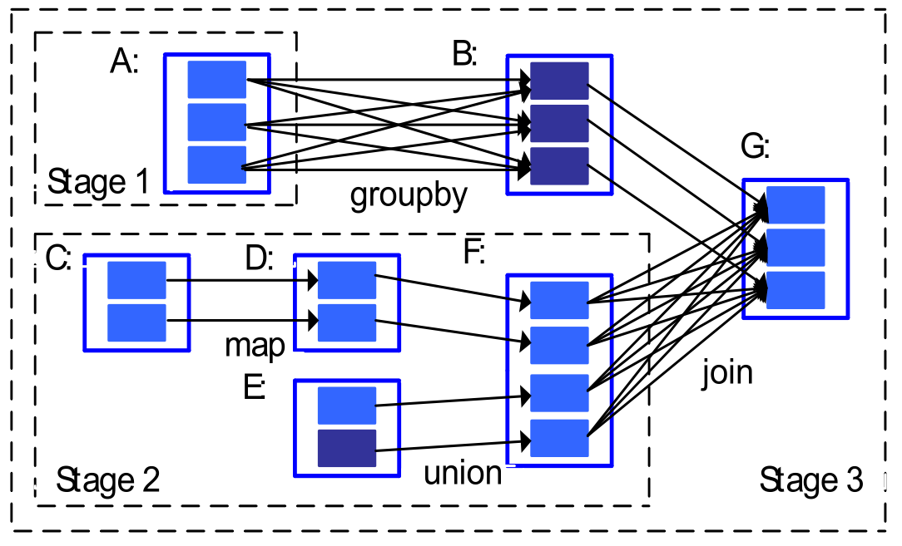
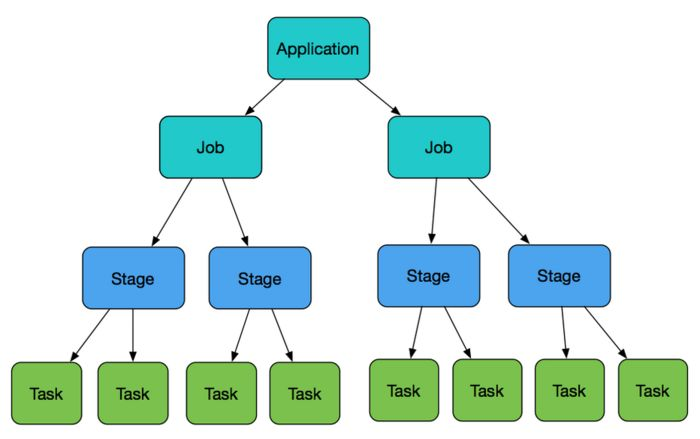

# 一、Spark 原理与架构 #

## Spark core ##
### Spark核心概念RDD ###
* RDD 即弹性分布式数据集，是一个只读的，可分区的分布式数据集。
* RDD 默认存储在内存，当内存不足时，溢写到磁盘。
* RDD数据以分区的形式在集群中存储。
* RDD具有血统机制，发生数据丢失是，可快速进行数据恢复

### RDD的依赖关系 ###
* 一父一子 是窄依赖   ,常见算子有 map、filter、union、mapPartitions、mapValues等
* 一父多子 是宽依赖   ,常见算子有groupByKey、partitionBy、reduceByKey 等

### RDD Stage 的划分 ###
* Stage 划分的主要依据是宽依赖，也就是碰到宽依赖就划分成新的Stage

### RDD的算子 ###
* Transformation
	* Transformation 是通过转换从一个或多个RDD生成新的RDD，该操作是lazy,当调用action 算子，才发起job 
	* 典型的算子：map 、flatMap 、filter 、reduceByKey 等

* Action
	* 当代码调用该类算子是，立刻启动job
	* 典型算子：take 、count、saveAsTextFile 等

### Spark 重要角色 ###
* Driver 
	* 负责应用的业务逻辑和运行规划（DAG）
* ApplicationMaster
	* 负责应用的资源管理，根据应用的需要，向ResourceManager申请资源。
* Client
	* 需求提出方，负责提交需求（应用）
* ResourceManager
	* 资源管理部门，负责整个集群的资源统一调度和分配
* NodeManager
	* 负责本节点的资源管理
* Executor
	* 实际任务的执行者。一个应用会分拆给多个Executor来进行计算

https://blog.csdn.net/mys_35088/article/details/89458415

https://www.toutiao.com/i6637035681300349453/?tt_from=weixin&utm_campaign=client_share&wxshare_count=1&timestamp=1583390967&app=news_article&utm_source=weixin&utm_medium=toutiao_ios&req_id=202003051449260100100350211F3B3314&group_id=6637035681300349453

### spark任务提交运行流程 ###

			                        Application --> 多个job --> 多个stage --> 多个task

1.Spark的driver端只是用来请求资源获取资源的，executor端是用来执行代码程序，也就是说application是在driver端，而job 、stage 、task都是在executor端。

2.在executor端划分job、划分stage、划分task。

程序遇见action算子划分一次job，每个job遇见shuffle（或者宽依赖）划分一次stage，每个stage中最后一个rdd的分区（分片）数就是task数量。	

​	

## Spark SQL 和 Dataset ##

## Spark Structured Streaming ##

## Spark Streaming ##

# 二、Spark 与MapReduce 比较 #
